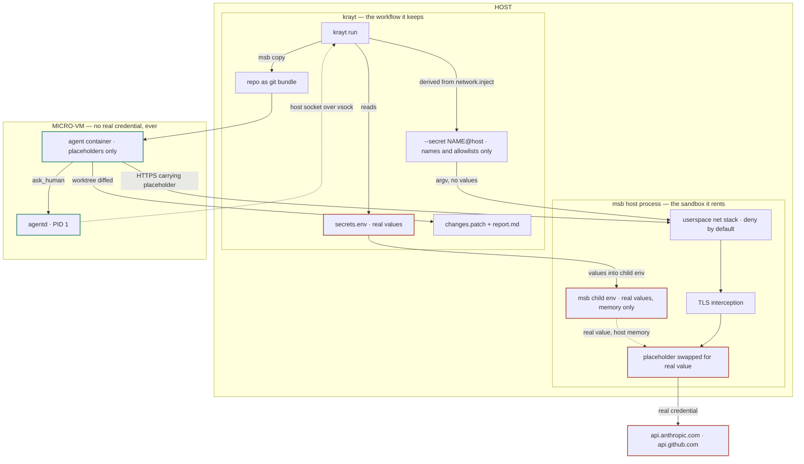

# ADR: Replacing krayt's sandbox layer with microsandbox

- **Status:** Proposed. **B1 is the working direction, with no blocking technical gate remaining.**
  What is left to decide is strategic, not technical — see "The two questions that are not
  technical". Nothing in this document has been implemented.
- **Decided so far:** the secret-handling contract — values never on argv, never persisted;
  owner-readable environ accepted as the residual. See "The secret-handling contract".
- **Date:** 2026-08-29
- **Affects:** `KRAYT_SPEC.md` §3, §6.3–§6.6, §6.10–§6.12, §11, §14 (Phases 1, 7, 8, 9)
- **Supersedes nothing.** A narrower version of this question — microsandbox as a fourth
  `Provider` — was evaluated and rejected on the same date; see `KRAYT_SPEC.md` §15. This ADR is
  the broader question that rejection deliberately did not answer.

## Context

krayt builds its own sandbox from the hypervisor up: a `Provider` seam over vfkit and Firecracker,
a Nix-built NixOS VM image, a guest agent driving containerd over gRPC-on-vsock, and a host-side
TLS-intercepting egress proxy that injects credentials so they never enter the VM. Phases 0–10 are
done and hardware-verified.

[microsandbox](https://github.com/superradcompany/microsandbox) (`msb`) is a libkrun-based microVM
runtime — Rust, Apache-2.0, ~8k stars, self-described beta, YC-backed with a paid cloud tier the
OSS runtime routes to. It occupies the same layer as krayt's entire VM + guest + protocol + proxy
stack: OCI images as microVM rootfs, exec/filesystem APIs, network access control, TLS
interception, host-side secret substitution, snapshots, SSH, metrics.

The §15 rejection was correct for the question it asked. Forcing msb *beneath* krayt's `Provider`
interface fails on cgo, on the absence of a host→guest channel matching `VM.DialControl`, on a
`VMSpec` whose kernel/initrd/cmdline fields msb cannot honour, and on running two overlapping
security models at once.

**Three of those four objections are artifacts of the seam, not of msb.** Removing the constraint
that msb sit under `Provider` dissolves them: cgo is avoidable by driving the `msb` CLI (the trade
is worked through in "Integration path" below), `DialControl` stops
mattering because krayt would use msb's own exec/filesystem API instead of its own gRPC protocol,
and there is no third VM image because there is no krayt VM image at all. The fourth objection —
duplicated security models — stops being an objection and becomes the proposal.

So the real question was never asked: **should krayt stop building a sandbox and start consuming
one?**

## What is actually at stake

Measured against the tree at `4053d2f`:

| Would be deleted | LOC | | Would survive | LOC |
|---|---:|---|---|---:|
| `internal/proxy` | 4,030 | | `internal/cli` | 6,114 |
| `internal/provider` | 2,983 | | `internal/orchestrator` | 5,241 |
| `internal/guest` | 2,506 | | `internal/task` | 1,904 |
| `internal/protocol` | 1,841 | | `internal/patch` | 1,508 |
| `internal/vmimage` | 771 | | `internal/{imagestore,imagecache,selfupdate}` | 1,564 |
| `cmd/krayt-{agent,vsock-forward}` | 441 | | `internal/adapter` | 824 |
| `images/*.nix` | 266 | | `cmd/krayt-ask` | 306 |
| `internal/controlclient` | 213 | | `internal/secrets` + `cmd/krayt` | 278 |
| **13,051** | | | **17,739** | |

`internal/controlclient` is the host end of the vsock control protocol, so it goes with it.
`cmd/krayt-ask` survives as a contract with the agent image, rewired to dial `AF_VSOCK` to host
CID 2 directly (see "The guest helper").

Against the deleted column, B1 adds back one thing: a **new guest helper binary of roughly 300–600
LOC**, embedded in krayt and copied in per run. It is counted nowhere above because it does not
exist yet. Netting it out, B1 deletes about 12,500 lines rather than 13,051.

The Go count understates it. Also deleted: the Nix image CI (§11.5) and its Linux-builder
requirement, the backend-tagged image variants, the vmimage OCI publish/pull/zstd path,
`hack/linux-net-setup.sh`, and the per-VM tap + `/30` + `cap_net_admin` allocation.

**The ~40% that would go is very nearly the 40% that cannot be verified without an
Apple-Silicon Mac or a KVM host** — the work `CLAUDE.md` flags as un-automatable and that keeps
accumulating in `HUMAN_TODO.md`. Two open questions disappear outright: linux/arm64 (blocked today
because the image index carries an arch dimension but no backend dimension —
`internal/vmimage/store.go:217` matches on `runtime.GOARCH` alone) and Windows, for which krayt has
no path at all.

## The security-model comparison

This is the part that decides it, and it is closer than expected.

msb's secret handling is krayt Phases 9 + 10. Placeholder in the guest, real value in host memory
only, substituted at the TLS boundary on egress to an allowed host — the same property
`inject-claude-oauth-token-at-proxy.md` proved on hardware (`run_df97fffa`).

On two gates msb is **ahead** of krayt as built:

- **DNS pin** — the destination IP must have been resolved for that host through the interceptor, so
  a hard-coded IP with a forged SNI never qualifies. krayt addresses this territory separately in
  `add-proxy-ssrf-guard.md`.
- **Authority alignment** — for intercepted HTTP the request's `Host`/`:authority` must match the
  SNI, closing domain-fronting.

It also fails closed: where an injection is eligible but cannot be substituted safely (HTTP/2
bodies, gzipped bodies, very large fixed-length bodies) the request is blocked rather than sent
wrong. Its documentation is candid about its own edges in the same register this spec uses.

### The interception CA: a residual, not a gate

msb's default interception CA is stored at `~/.microsandbox/tls/ca.{crt,key}` and reused by every
local sandbox. krayt's Phase 9 built the opposite: an ephemeral, in-memory, per-run ECDSA CA whose
private key never leaves the proxy child.

**The difference matters less than it first appears, and the reasoning is worth recording so it is
not re-litigated.** A CA private key lets its holder forge certificates that clients trusting that
CA accept. The clients here are the **guests** — the CA is installed in the sandbox trust store, not
the host's. It does not decrypt past traffic (session keys are not derivable from it) and it does
not yield secrets.

So the attack is: forge a certificate and impersonate an allowed host *to a sandbox*. Using the key
requires same-uid host filesystem access — and that user can already read `secrets.env`, ptrace
krayt, and read msb's heap where the real credential lives. They do not need the CA. Cross-sandbox
gives nothing either: sandboxes share no network namespace, so a shared CA does not let one run
observe another's traffic. And the party being impersonated-to is the guest, which is the party the
whole design already distrusts.

What survives is narrower: **a key on disk in a home directory has a different exposure class than
one that never exists outside a process** — cloud-synced homes, backups, support bundles, other
same-uid applications. That is a residual worth recording, not a reason to keep
`internal/proxy`. msb accepts a supplied CA, so krayt can mint one per run later without
re-architecting anything.

### Default posture: what a bare sandbox gets

Directly relevant to design principle 4 — *"Default-deny. Network egress, secrets, and host access
are all opt-in per task"* — so it was verified rather than assumed.

**Mounts: none.** `docs/security/filesystem.mdx`: "the guest sees exactly two things: the image's
root filesystem, and whatever you explicitly mount… There is no implicit passthrough of host paths,
environment, or credentials into the guest." The device list agrees — virtio-fs carries only what
you mount, and there are "no host PCI devices, no host sockets, and no shared memory beyond these
devices." No volumes, no scripts dir, nothing under `/.msb` unless declared. **This matches krayt's
model exactly.**

**Connections: two.** `virtio-console` to `agentd` is always present — it is how exec and copy work
— and is host-driven only, so it is a like-for-like swap for krayt's vsock control channel rather
than an addition. `virtio-net` is the problem.

**msb fails open where krayt fails closed.** `common.rs:417-418`:

> Default action for egress traffic that doesn't match any `--net-rule`. Default: deny (with an
> implicit `allow@public` rule when no other rules are present).

A bare sandbox therefore reaches the public internet, where krayt's default is `allowlist`. The
implicit rule applies **only when no other rules are present**, and krayt always emits rules from
`krayt.yaml`'s allow list — so the normal path is safe. The trap is `network.mode: none`: translating
"no allowed hosts" into "no `--net-rule` flags" hands the sandbox the entire internet, the exact
inverse of what `none` means. The correct translation is `--no-net`, whose own flag doc reads
"without rules, the guest has no network reachability."

**Design rule that follows: krayt must refuse to create a sandbox unless it has explicitly emitted a
network policy**, never relying on msb's default. That also insulates krayt from a beta project
changing that default later.

Two smaller changes to record rather than discover:

- **Ingress defaults to `allow`** — "preserves today's unfiltered published-port behavior when no
  ingress rules are set." Harmless while nothing is published, but unfiltered the moment krayt
  publishes a port.
- **The guest regains DNS.** msb allows DNS through its gateway by default. Since Phase 8 krayt's
  guest has had no usable network at all in `allowlist`/`none` — everything rides vsock to the host
  proxy. Policed by msb's gateway with DNS-rebind protection, so not a leak, but it is a capability
  the guest does not have today.

Everything else is opt-in and off by default: published ports (binding `127.0.0.1` when used),
`--vsock` routes, SSH, volumes. `host.microsandbox.internal` resolves but is denied, as are
loopback, RFC1918, link-local and `169.254.169.254`.

### The mechanism difference resolves better than it first appears

There is a **mechanism difference**, and it resolves better than it first appears. krayt does
*shape translation*: `internal/adapter/anthropic_wire.go` knows the provider's wire format, and the
rule is strip `x-api-key` + `authorization`, then set the right one from the secret. The container's
placeholder value is discarded and the proxy writes a fresh header. msb does *placeholder
substitution*: it finds the placeholder string the workload already sent and swaps it in place.
`inject: [headers|basic_auth|query_params]` scopes where a swap may happen — it does not synthesize
a header the workload never sent.

**Shape mirroring has already put krayt where msb's model wants it.** Per the 2026-08-18 decision
recorded in `anthropic_wire.go`, the container gets the same env var the user supplied carrying a
placeholder; Claude Code then runs its own code path for that shape, emits every OAuth-specific
detail itself — `oauth-2025-04-20`, the beta list, the request line — and "the proxy swaps exactly
one header value." Under msb the CLI would emit `x-api-key: $MSB_…` or
`authorization: Bearer $MSB_…` unprompted, and msb would swap the placeholder without needing to
know which header it was in. Matching on the string does the work the header-name table does today,
which is what would make deleting `anthropic_wire.go` — and §6.14's dated dependency on Anthropic's
wire format — realistic rather than hopeful.

What remains is a placeholder-shape design choice and one confirmation run; see question 2.

The in-guest posture difference — msb runs workloads as root under `agentd` as PID 1, versus
krayt's hardened OCI spec (dropped caps, non-root, seccomp) from `harden-container-oci-spec.md` — is
smaller than it looks. It is the same argument already accepted here: the ephemeral VM is the
blast-radius control, and in-container hardening is defence in depth, not the boundary.

## What krayt would still be

Everything in the surviving column, and it is the part with the most design in it: the
bundle/baseline/patch model (§6.7), the report and meta schemas (§8.4), the `ask_human` channel
(§6.13), the adapters and their exactly-one credential rule (§6.14), the agent images, concurrency
and run records, `krayt apply`.

msb provides none of that. It provides a sandbox with `exec`. The task→patch→review workflow is
krayt's, and it is what users actually touch.

The §2 identity claim survives too: still a full VM boundary per task, still not shared-kernel
sandboxing.

## Integration path: CLI or SDK

Under B or C, krayt talks to msb one of two ways. There is no third: the REST API at
`api.microsandbox.dev` is **cloud-only and in private beta**, and its own documentation says the
sandbox command channel — exec, streaming, PTY, file transfer, SSH — "is not part of this REST
surface." Locally it is the Go SDK or the `msb` binary.

**The Go SDK** (`github.com/superradcompany/microsandbox/sdk/go`) is a cgo `dlopen` bridge to an
embedded Rust library (`#cgo linux LDFLAGS: -ldl`). No Rust toolchain is needed to build, but
`CGO_ENABLED=1` is. It has zero Go module dependencies, and it is version-pinned internally
(`sdkVersion` 0.6.16, `libkrunfw` 5.6.1).

**The `msb` CLI** is krayt's existing house idiom — the vfkit and Firecracker providers both drive a
subprocess and speak to it over a socket. It covers what krayt needs: `--vsock HOST_PATH:PORT` for
the guest→host channel `ask_human` would ride, `--secret NAME@HOST`, `--net-rule`, `--env`,
`msb copy`, and exec in pipe mode with stdout/stderr separated end to end. Structured output exists
where it matters most: `msb logs --json` emits JSON Lines tagged by stream, which is exactly the
shape `internal/orchestrator`'s log streaming wants, and `ls`/`ps`/`metrics`/`modify` take
`--format json`.

**Recommendation: the CLI**, for one decisive reason. The SDK does not remove the runtime dependency
on the `msb` binary — it *downloads* it, along with libkrunfw, into `~/.microsandbox` on first use.
So both paths require the msb runtime installed on the host, exactly as the vfkit provider requires
`vfkit` today (§12). The SDK therefore buys a typed API at the cost of cgo without buying
independence from the binary. Paying cgo means losing `CGO_ENABLED=0` and the single-Linux-runner
cross-build in `.github/workflows/release-please.yml:52-70` — darwin/arm64 would need its own macOS
runner. That is a real cost for an API krayt can get from `--format json`.

### How secrets actually reach msb

msb never accepts a credential on argv — `--secret` takes `NAME@HOST[,HOST...]`, and the inline
`NAME=VALUE@HOST` form is rejected on both `create` and `modify` precisely because shell history and
process listings would leak it. So argv is not the axis to worry about. The axis is **where the
value comes from instead**, and there are exactly three sources.

A **file** is accepted: `--secret-conf PATH` (or `--conf`) takes a map of secret definitions. But a
file does not escape the environment, because each of its three forms lands somewhere:

```yaml
secrets:
  OPENAI_API_KEY:                    # value omitted → read from the host env var of the same name
    allow: ["api.openai.com"]
  DATABASE_URL:
    value: "${DB_DSN}"               # exact ${NAME} → records DB_DSN as a host-side source,
    allow: ["db.internal"]           #   resolved when the sandbox starts, NOT copied to disk
  LEGACY_KEY:
    value: "sk-real-value-here"       # plaintext → copied into the durable sandbox config on disk
    allow: ["api.example.com"]
```

Only the plaintext form avoids the host environment, and it is the one form that must not be used:
msb's docs are explicit that a raw value "is stored as-is in the sandbox config file and stays there
until you rotate the secret to a reference."

(This is the *source* question — what a config file can express. krayt does not need a config file
for secrets at all; the repeatable `--secret NAME@HOST` flag covers it. See "Handing secrets over".)

**The SDK is not an escape hatch if env delivery is unacceptable — it is *worse*.** `SecretEntry` carries a raw `Value string` and nothing else at create
time, and msb warns that raw values passed through any SDK are persisted to the sandbox config on
disk. So the SDK's only create-time secret path writes the credential to host disk, which is a
sharper departure from §6.8's "never persisted" posture than an environment variable is.

**Therefore the CLI plus an env-reference is the best secrets path msb offers, not a compromise the
CLI forces.** The residual cost is real but small: krayt's Phase 9 deliberately hands injected keys
to the proxy child on stdin, keeping them out of **argv and env alike**, and this is a step back
from that. It is the environment of a short-lived child krayt spawns — not a shell, not exported —
readable only by the same uid that can already read krayt's own memory and its host-side secrets
file. Both threat models put host compromise out of scope. Worth deciding deliberately; not worth
paying cgo to avoid, since cgo does not avoid it.

Keeping krayt's own proxy and handing msb no credentials at all remains possible; that is Option B2
below.

## The secret-handling contract (decided)

Under B1 the goal is stated, and these are the verdicts against it. Everything here is verified
against msb's source, not its documentation.

| Requirement | Verdict |
|---|---|
| msb owns runtime credential substitution | **met** |
| `krayt.yaml` carries hosts + placeholders, never a secret | **met**, with one correction below |
| values live in `secrets.env`, injected at runtime | **met** |
| values never on argv, never persisted | **met and enforced by msb itself** |
| values never visible anywhere in the process tree | **not met — accepted** |

### Why the last one was narrowed

`packages/microsandbox-types/rust/lib/modify.rs:142` is the complete set of host-side sources:

```rust
pub enum SecretSource {
    /// Read the value from a host environment variable at apply time.
    Env { var: String },
    /// Read the value from a host-side secret store reference.
    Store { reference: String },
}
```

No file variant, no fd variant, no stdin. `SecretSource::Store` has **zero usages anywhere in the
repository** — declared in the types crate, never constructed and never resolved. The CLI only ever
builds `Env` (`common.rs:2027`). The only alternative is an inline value, which is SDK-only and
lands in msb's durable config.

So the host environment is the sole wired channel, and environment is process metadata: on Linux
`/proc/<pid>/environ` is mode 0400, readable by the owning uid and by `ps e`.

The requirement was narrowed to **never on argv, never persisted** because that is the boundary that
actually buys something. The adversary excluded by the stricter form is same-uid — a user who can
already read `secrets.env` (0600), ptrace krayt, and read the msb runtime's heap, where the value
lives in memory no matter how it arrived. What the narrowed form excludes is *world-readable*
exposure: argv in `ps`, pasted bug reports, CI logs. msb enforces that itself by rejecting inline
`NAME=VALUE@HOST` on both `create` and `modify`.

Two findings land in krayt's favour, both source-verified: `SecretEntry.value` is
`Zeroizing<String>` — "wiped when the entry drops", better than msb's own docs claim — and the
reference model means "the durable config never stores secret material at rest"
(`common.rs:2016`).

**This deliberately overturns §6.6.1**, which routes krayt's own injected credential over stdin
specifically to keep it out of a child's environment. That trade is made knowingly here, not
by accident; `egressProxyChildEnvKeys`' comment should be amended rather than left contradicting
this ADR.

### The correction to the `krayt.yaml` requirement

msb does **not** replace a named header. It substitutes a placeholder *string* wherever it appears
in a request to an allowed host. `krayt.yaml` can therefore carry an env-var name, its allowed
hosts, and optionally a custom placeholder — but it cannot say "put this in `authorization` with
prefix `Bearer `". The tool must emit the placeholder itself, which under shape mirroring `gh` and
Claude Code both do.

The security consequence, which is not obvious from the requirement as stated: **msb never strips a
pre-existing auth header.** krayt today strips `authorization` and `x-api-key` before setting one.
Under B1, a credential the agent obtained elsewhere and placed in that header, addressed to an
allowed host, goes out untouched.

## How a run would flow under B1

The load-bearing property is the credential boundary: the real value exists only in krayt's own
memory and msb's host process, and the micro-VM never holds anything but a placeholder. Substitution
happens on the **host**, in msb's userspace network stack — there is no host kernel routing or NAT
in the path, and the guest's `localhost` never reaches the host at all.



Red-outlined nodes hold a real credential; green-outlined nodes only ever see a placeholder. The
boundary runs along the VM edge, which is the whole point.

Two things the diagram makes visible that prose buries. The policy reaches msb **on argv carrying
no values** — `--secret NAME@host`, one per credential — so the only path a real value takes is
`secrets.env` → krayt memory → msb's child environment, and nothing is written to disk at any point.
And the `ask_human` channel is the one guest-initiated path, riding msb's `--vsock` host socket
rather than the network, exactly as `krayt-vsock-forward` does today.

## The guest helper (a component of B1)

B1 deletes the guest agent, which leaves nobody trusted inside the sandbox to build the patch. A
**small, stateless helper binary** — copied in per run and invoked with `msb exec` — closes that
gap without rebuilding `internal/guest`.

### Why it works: per-exec user

`crates/cli/lib/commands/exec.rs:32` gives `msb exec` a user override:

```rust
#[arg(short = 'u', long)]
pub user: Option<String>,
```

This is the load-bearing fact. It restores the privilege separation `fix-guest-git-config-rce.md`
depends on: create the sandbox with `--user app`, run the agent's exec as `app`, run the helper as
root. The agent then cannot write into a root-owned git dir, which is exactly the property that
Critical fix bought. **Without per-exec `--user` the helper would run as the same root the agent had
been running as, and the isolation would be theatre.**

### What it does

- **Setup** — clone `/workspace` from the inbound bundle and record the `krayt-baseline` tag.
- **Patch** — `git diff` against that baseline in a root-only git dir. `internal/patch` survives B1
  already, so the helper is largely a thin wrapper over code krayt keeps.
- **Artifact assembly** — including the matched-secret-key-names list that `meta.json` carries
  (§6.8, §8.4), which wants to run somewhere the agent cannot tamper with.

### Distribution

`go:embed` a static `linux/amd64` and `linux/arm64` binary into krayt; `msb copy` the right one in
per run. No registry, no OCI artifact, no Nix, no boot test — and no kernel or rootfs, so the
backend-tagged-image problem (§11.1) does **not** recur. It is versioned with krayt by construction,
so there is no skew to manage.

### Scope boundary — a constraint, not a preference

**Stateless, exec'd, argv in and JSON on stdout, exits.** No gRPC, no control protocol, no
long-running process, no supervising the workload. That keeps it at roughly 300–600 LOC and does
*not* resurrect `internal/protocol` (1,841), containerd driving, or nftables setup.

If it ever grows a listener or starts supervising the agent, krayt has re-created the guest agent
inside someone else's sandbox while keeping none of B1's benefit, and the ledger above must be
re-examined at that point.

### `ask_human` must not go through it

Routing the question channel through the helper would require a listener, which is precisely the
boundary above. Instead `krayt-ask` — already present in the agent images — should dial `AF_VSOCK`
to host CID 2 on the `--vsock` port directly. No guest daemon, and it additionally retires
`cmd/krayt-vsock-forward` (368 LOC).

### Resulting run lifecycle

1. **create** — image, `--secret NAME@host` per credential (values in `cmd.Env`), net rules,
   `--vsock` for `ask_human`, placeholder env, resources, `--max-duration`. Everything
   policy-shaped is create-time: `--secret` and `--vsock` are create flags, and msb requires a
   restart to add a secret to a running sandbox.
2. **copy in** — git bundle, `/task/prompt.md`, and the helper binary.
3. **exec (helper, as root)** — clone from the bundle, tag `krayt-baseline`.
4. **exec (agent, as `app`)** — the adapter's command; stream logs; `krayt-ask` rides vsock back.
5. **exec (helper, as root)** — diff against the baseline, assemble artifacts.
6. **copy out** — `/output/*`, including the agent's own `report.md` if it wrote one.
7. **host** — render `report.md` (host owns the Run/Changes sections, agent notes folded into Notes,
   `report.go:17-22`) and write `meta.json`. Neither is an exec.
8. **stop + rm**.

### Unverified

- Can a non-root container process open `AF_VSOCK` under msb's guest? Needed for the `krayt-ask`
  path above.
- Does exec-as-root still work under msb's `restricted` security profile (`no_new_privs`)? `agentd`
  is PID 1 as root and spawns each exec, so it should — but if not, the choice is between the
  restricted profile and the helper's privilege separation.

Both are one-command checks on hardware and are folded into question 3.

## Config surface under B1

Under B1 two things need designing: how values reach msb, and how much of msb's schema surfaces in
`krayt.yaml`.

### Handing secrets over

**No file is written, and no secret reaches argv.** Verified against
`crates/cli/lib/commands/common.rs:548-562`, which is the complete argv surface for secrets:

```rust
/// Inject a secret that is only sent to allowed hosts (ENV@HOST[,HOST...]).
/// The value is read from the host environment variable ENV at start time
/// and stored only as a source reference, never inlined in the sandbox
/// config. Inline `ENV=VALUE@HOST` is rejected; export the value and use
/// `ENV@HOST[,HOST...]`.
#[arg(long)]
pub secret: Vec<String>,
```

`Vec<String>` is repeatable, so the whole hand-off is three channels and only one carries a value:

| krayt input | Channel | Carries a secret? |
|---|---|---|
| `krayt.yaml` `network.inject[]` | `--secret NAME@host1,host2`, one per credential | no — name + hosts |
| `krayt.yaml` `network.allow` | `--net-rule` / `--net-default-*` | no |
| `secrets.env` values | `cmd.Env` on the spawned `msb` | **yes — this only** |

**The mechanism for the value channel** is `exec.Cmd.Env`, the pattern
`internal/orchestrator/egressproxy.go:181` already establishes: an explicit, minimal env — never
`os.Environ()` — built from a closed allowlist of process-hygiene keys (`PATH`, `HOME`,
`SSL_CERT_FILE`, `SSL_CERT_DIR`, `MSB_HOME`) plus the names read out of `secrets.env`. Values travel
in the `execve` envp array: no disk, no argv, no shell.

That does overturn a rationale krayt wrote down — `egressProxyChildEnvKeys`' comment says
`/proc/<pid>/environ` readability "is precisely why §6.6.1 routes krayt's OWN injected credential
over stdin instead", and msb offers no stdin path. Be precise about the size of that step, though.
The comment guards two things: the child inheriting *the operator's whole environment*, which the
minimal-env discipline closes regardless; and the credential being readable at
`/proc/<pid>/environ`, which is same-uid only (mode 0400), unlike the world-readable
`/proc/<pid>/cmdline` that makes argv unacceptable. And msb holds the real value in host process
memory for the sandbox's lifetime either way, un-zeroized, by its own documentation — so the env
does not widen the surface for *that* process, only for other same-uid processes that could already
read krayt's memory and `secrets.env` directly.

**Timing.** The source comment above says the value is read "at start time", not at config-load
time. The env must therefore be set on whichever invocation actually *starts* the sandbox. Because
the CLI hands off to a per-sandbox host runtime that holds the value for the sandbox's lifetime, a
later `msb exec` against an already-running sandbox needs no env. A single `msb run` makes the
question moot.

**Why no file is needed.** A `--secret-conf` YAML is only required for three fields argv does not
expose — `placeholder`, `require_tls_identity`, and `inject: [headers|basic_auth|query_params]`.
`require_tls_identity` already defaults to true and the placeholder already defaults to
`$MSB_<env_var>`, so krayt likely needs none of them. If one is ever needed, stdin is *not* an
option (`sandbox_config.rs:794`'s `parse_yaml_value` is a plain `fs::read_to_string(path)` with no
`-` handling), but `/dev/fd/N` backed by a pipe or memfd via `cmd.ExtraFiles` is — safe for
`--secret-conf` specifically, since `load_typed` does not call `absolutize_input` the way a root
`--conf` does.

**Reassurance from msb's own design.** `sandbox_cmd.rs:322`: the launcher "keeps only
operator-readable labels on the real argv and serializes the rest — network config, env (including
secrets), mounts, and paths — to an inherited fd, so they no longer appear in `ps` or
`/proc/<pid>/cmdline`." The values krayt puts in `msb run`'s environment reach the long-lived
runtime over a pipe, not disk and not argv.

**One conflict rule to design around.** `common.rs:401-434`: `--net-rule`, `--net`,
`--net-default-egress` and `--net-default-ingress` all carry `conflicts_with = "net_conf"`. Network
policy is flags **xor** scoped file — clap rejects mixing them. `--secret` has no such conflict with
`--secret-conf`, so those two may be combined.

### What actually leaks — krayt.yaml loses vocabulary, it does not gain it

| `krayt.yaml` today | Under msb |
|---|---|
| `network.allow` | maps 1:1 to msb `network.allow` |
| `network.passthrough` | msb's TLS bypass list — same concept, different name |
| `network.mode` | ≈ msb `network.policy` |
| `network.mitm: true` | **gone** — declaring any secret enables TLS interception automatically |
| `inject[].host` | becomes the secret's `allow:` list |
| `inject[].set` (header name) | **gone** — msb matches the placeholder string, not a header |
| `inject[].set_prefix` | **gone** — the tool emits its own scheme (`gh` sends `Bearer` itself) |
| `inject[].strip` | **gone, with no replacement** — see the contract section |

Today's rule for `api.github.com` — `host` + `strip` + `set` + `set_prefix` — collapses to four
lines naming a key and a host. The header knowledge moves out of krayt's config and into the tool's
own behaviour, which is the shape-mirroring decision of 2026-08-18 generalised to every credential.

Everything else in `krayt.yaml` is krayt workflow vocabulary and does not touch msb: `image`, `env`,
`bundle_depth`, `agent.adapter`, `questions.mode`, and `secrets:` itself.

### Two rules to design around now

msb's config precedence is "each file overlays everything to its left", and **network policy is
atomic**: when a higher-precedence source supplies any of `policy`, `allow`, or `deny`, those values
*replace the complete lower-layer policy* rather than merging into it. Secrets merge by
environment-variable name, so a later file can silently redefine a secret's allowlist.

Ordering is therefore a security decision, not a convenience. krayt must pass its own
security-relevant config **last**, or refuse overlapping keys outright.

The second rule is from "Default posture" above: **never emit an empty network policy.** msb's
implicit `allow@public` fires when no rules are present, so `network.mode: none` must translate to
`--no-net`, not to the absence of `--net-rule` flags. krayt should treat "no network policy
computed" as a pre-flight error rather than a valid state.

### Recommendation: translate, don't forward

`krayt.yaml` is a *task* config; splicing msb's schema into it makes the file bi-vocabulary. §8.3's
containment rule — refusing `network.mitm`/`inject`/`passthrough` from an auto-loaded repo-local
config, because the agent can edit that file — only works over a closed set of keys krayt models, so
passthrough config means inheriting that question for every future msb field. And msb is beta: a
translation layer is one file to update, where a passthrough permanently couples `krayt.yaml`'s
public schema to a vendor's beta schema.

For what krayt does not model (DNS policy, published ports, rlimits, CPU placement), a bounded
escape hatch beats schema growth: an opt-in `sandbox.extra_conf: <path>` passed as an additional
`--conf` **before** krayt's own, explicitly unvalidated, and subject to §8.3 containment in full.

## Options

**A. Status quo.** Keep krayt's own stack. §15 already records msb-as-`Provider` as rejected; this
ADR would be closed as "considered, declined". Cost: continue carrying the image pipeline, the
guest agent, the proxy, and the hardware-verification burden. linux/arm64 and Windows stay closed.

**B1. Wholesale replacement, msb owns secrets — the working direction.** Delete the sandbox layer
*and* `internal/proxy`; build the workflow on the `msb` CLI and let msb do credential substitution
under the contract above. **13,051 LOC deleted.** `internal/adapter/anthropic_wire.go` goes with it,
and §6.14's dated dependency on Anthropic's wire format goes with that. msb's DNS-pin and
authority-alignment gates come free. Keeps a small stateless guest helper for patch generation
(see "The guest helper"). Inherits msb's shared on-disk interception CA unless krayt supplies its
own (question 5, non-blocking), and gives up header stripping.

**B2. Wholesale replacement, krayt keeps injecting.** Delete the sandbox layer but keep
`internal/proxy`: run on msb, expose krayt's own egress proxy to the guest through
`--vsock HOST_PATH:PORT`, and keep Phase 9/10 injection exactly as built. This maps unusually
cleanly onto what already exists — a guest dialing a host unix socket over vsock for every outbound
connection *is* the Phase 8 architecture. **~9,000 LOC deleted**, msb's two extra gates go unused,
`anthropic_wire.go` stays. In exchange the credential never enters another vendor's process, the
ephemeral per-run CA survives, and header stripping is retained.

B1 and B2 are both irreversible in the same way: once the provider, guest and image layers are gone,
returning is a rebuild, not a revert. They differ only in who owns credential injection — so B2 is
the fallback if the strategic questions go against renting the boundary, not a separate
programme.

**C. Dual runtime behind a new seam.** Introduce a `Sandbox` abstraction *above* `Provider`, keep
vfkit/Firecracker working, and prove msb on real workloads before deleting anything. De-risks the
vendor bet and makes the comparison empirical rather than documentary. Costs double maintenance and
two security models while it lasts — acceptable only with an explicit delete-the-loser date, or it
becomes permanent by default.

## The two questions that are not technical

1. **Own the trust boundary, or rent it?** Today it is Apple's Virtualization.framework via vfkit
   (which podman, minikube and crc depend on) or Firecracker (AWS, battle-tested). Under B or C it
   becomes libkrun — solid, Red Hat, backs podman machine — *plus* microsandbox's own `agentd`,
   relay, CBOR protocol and userspace smoltcp network stack. That newer layer is where the boundary
   would live, in beta software that has already retracted a release for shipping breaking wire
   changes as a patch.

2. **The vendor is adjacent to this space.** microsandbox ships an MCP server and Agent Skills so
   "your agents can create their own sandboxes", advertised as working with Claude Code, Cursor,
   Codex and Gemini CLI, alongside a paid cloud tier. Features are already tagged "Local-only" and
   "Limited on cloud". Building on it is a bet that it stays a good primitive rather than growing
   into the workflow layer.

## Open questions — must be answered on hardware before deciding

**None of these decide between B1 and B2 any more.** Questions 1 and 3 need an Apple-Silicon Mac
but shape the implementation; question 2 is a design choice plus a confirmation run; questions 4 and
5 size residuals the project has already accepted. What actually remains open is strategic, and it
is in the section above this one.

1. **Does a krayt agent image run unmodified under msb**, with the `ask_human` round-trip working
   over msb's guest→host vsock host-sockets?
2. **Does Claude Code accept a placeholder?** Largely settled from upstream sources; what remains
   is a design choice plus one confirmation run. The header-in-intercepted-HTTPS path is msb's
   primary, exercised use case, not an edge: `examples/python/net-secrets/main.py` ships a bearer
   token in an `Authorization` header over HTTPS, substituted for an allowed host and blocked for a
   disallowed one, and the README's headline example is `OPENAI_API_KEY` scoped to
   `api.openai.com` — an agent inside the sandbox calling an LLM API.

   Substitution has exactly three documented exclusions (`docs/security/secrets.mdx:51`): "HTTP/2
   request **bodies**, non-identity-encoded bodies, or very large fixed-length bodies". All three
   are body-shaped. Headers are the default `inject` target and `body` is a separate opt-in, so
   nothing in the header path is excluded.

   The real residual is not msb mangling the placeholder but **whether the agent CLI accepts one**.
   If Claude Code validates credential shape client-side — length, an `sk-ant-` prefix — it could
   reject `$MSB_ANTHROPIC_API_KEY` before any request leaves the container. krayt already solves
   this elsewhere: `krayt.yaml` uses `GH_TOKEN: krayt-injected-at-host-proxy`, a credential-shaped,
   self-describing placeholder. msb exposes a custom `placeholder` field (bounded by
   `MAX_SECRET_PLACEHOLDER_BYTES`), so **krayt should supply a shaped placeholder rather than take
   msb's `$MSB_<name>` default.** With that, one live run against `api.anthropic.com` confirms
   rather than decides.

3. **Does the guest helper hold up?** Largely answered by "The guest helper" above — `msb exec`'s
   per-exec `--user` restores the privilege separation `fix-guest-git-config-rce.md` needs, so the
   patch can be built in a root-only git dir the agent cannot reach. Two one-command checks remain:
   whether a non-root container process can open `AF_VSOCK` (needed for `krayt-ask` to reach the
   host directly), and whether exec-as-root still works under the `restricted` security profile's
   `no_new_privs`. If the second fails, the choice is the restricted profile *or* the helper's
   privilege separation, not both.
4. **How long is the environ exposure window?** Settled in principle — the contract above accepts
   environ — but the *duration* is unverified and cheap to establish. The launcher serializes config
   to the long-lived `msb sandbox` runtime over `--config-fd`. If the launcher resolves
   `SecretSource::Env` and the runtime receives the value over that fd, only the short-lived
   `msb create` process ever holds it in environ. The source says "at spawn time" without naming
   the process. On Linux:

   ```bash
   KRAYT_CANARY=sk-canary msb create python --name t --secret 'KRAYT_CANARY@api.example.com'
   tr '\0' '\n' < /proc/$(pgrep -f 'msb sandbox')/environ | grep KRAYT_CANARY
   ```

   Empty means the window is seconds; non-empty means it is the whole run. Either way B1 stands —
   this sizes a known, accepted residual rather than deciding anything.
5. **Should krayt supply its own interception CA?** Not blocking — see "The interception CA" for
   why the shared on-disk key is a smaller exposure than it looks. Worth doing eventually so the key
   never outlives a run, and msb accepts a supplied CA, so it can be added later without
   re-architecting. Decide it on its own schedule.

## Recommendation

**B1 is the working direction, and no technical finding now blocks it.** The accounting favours
it: it deletes the project's heaviest and least-verifiable 40%, opens two platforms, retires
`anthropic_wire.go` and §6.14's dependency on Anthropic's wire format, and picks up msb's DNS-pin
and authority-alignment gates.

Measured against the threat model that matters — an agent inside the sandbox that is not trusted —
msb wins or ties on every axis but one:

| | krayt today | Under B1 |
|---|---|---|
| Agent can obtain the real credential | no | no |
| Agent can exfiltrate it by sending the placeholder elsewhere | blocked by host allowlist | blocked, **plus** DNS pin, authority alignment, TLS identity |
| Agent can misuse it *at* an allowed host | yes | yes |
| Agent can smuggle a different credential out in `authorization` | **stripped** | **not stripped** |

The last row is the one real security regression, and it is bounded by the allowlist: the agent can
only send it somewhere already permitted. Everything else that looked like a blocker resolved —
question 2 into a design choice, question 5 into a residual (see "The interception CA").

**What is left to decide is not technical.** Own the trust boundary or rent it, and whether to build
on a vendor adjacent to this space. Those are the two questions above, and this ADR deliberately
does not answer them.

A and B2 remain live on those grounds, not on technical ones. C remains the hedge if the strategic
answer is genuinely unclear, and only with a delete-the-loser date attached.

Whatever is chosen, the decision belongs in `KRAYT_SPEC.md` — B1 and B2 both contradict §3.1,
§6.3–§6.6, §6.10–§6.12 and §11 outright, and B1 additionally overturns §6.6.1's stdin rule. Per
`CLAUDE.md` the spec wins until it is amended, not quietly diverged from.
